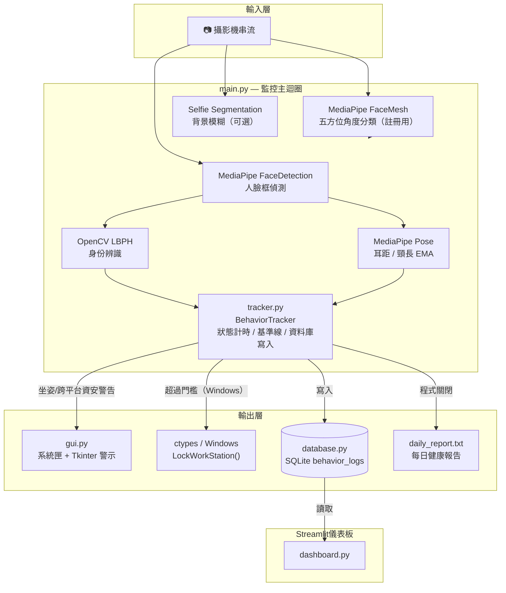
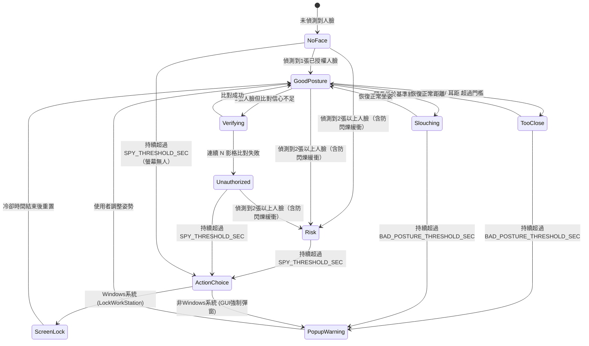

# 🛡️ AI Posture & Privacy Guard

以人臉辨識、姿勢偵測與螢幕防窺為核心的**邊緣運算安全防護程式**。
在本機以攝影機即時監控使用者身份與坐姿，偵測到未授權使用者或長時間偷窺風險時自動鎖定Windows螢幕（其他平台則彈窗警示），並提供Streamlit網頁儀表板檢視歷史健康與資安數據。

---

## ✨ 核心功能

- **FaceID風格五方位人臉註冊**：透過MediaPipe Face Mesh計算yaw/pitch，引導使用者依序完成`front / right / left / up / down`五個角度採樣，並以圓形進度環即時顯示採集進度。
- **本機人臉辨識**：以OpenCV LBPH模型比對擁有者臉部，非本人使用時進入`Verifying → Unauthorized User`狀態機。
- **坐姿與防窺偵測**：結合MediaPipe Pose（耳距／頸長 EMA 自適應基準線）與人臉佔比雙重防線，判斷「太近」、「駝背」、「多人入鏡（偷窺風險）」。
- **防閃爍緩衝與自動安全鎖定**：內建防閃爍緩衝機制（Debounce Buffer），避免攝影機單影格丟失導致計時重置。當資安風險（多人入鏡／未授權使用者／長時間無人臉）持續超過門檻秒數時，Windows 系統自動執行 `LockWorkStation()` 鎖定螢幕，非Windows系統則自動跳出GUI強制警示視窗。
- **背景去背模糊**（可選）：以MediaPipe Selfie Segmentation模糊背景，降低螢幕分享時的隱私外洩風險。
- **系統匣常駐 + Tkinter警示彈窗**：不良坐姿達到門檻時跳出提醒視窗，程式常駐於系統匣執行。
- **即時效能與資源回報**：整合`psutil`於攝影機畫面即時顯示當前推論FPS、CPU佔用率與RAM使用量，便於觀察背景運作狀態。
- **SQLite行為紀錄 + Streamlit儀表板**：所有狀態變化寫入本機資料庫，網頁儀表板提供圓餅圖、趨勢折線圖、時段分析與歷史明細表。
- **每日文字健康報告**：程式關閉時自動依當日紀錄計算健康分數並輸出`daily_report.txt`。

---

## 🏗️ 系統架構



---

## 🔄 監控狀態機

`main.py`的核心判定邏輯是一個狀態機：每個影格依「人臉數量 → 身份比對 → 坐姿分析」的順序決定目前狀態，再由`tracker.py`計時，超過門檻秒數才觸發彈窗或鎖定，避免瞬間誤判。



> 💡`Verifying`狀態是為了避免未授權使用者被誤標為Good Posture的邊界情況而新增的過渡狀態，需連續多影格比對失敗才會正式判定為`Unauthorized User`。

---

## 📂 專案結構

```
face/
├── README.md
├── requirements.txt      # 依賴套件（mediapipe精確鎖版，其餘標註Python 3.12相容下限）
├── Dockerfile            # 容器化建置設定（Python 3.12-slim）
├── docker-compose.yml    # dashboard + monitor雙服務編排
├── .gitignore
├── .dockerignore
│
├── src/                  # 核心程式碼
│   ├── main.py           # 監控主迴圈：人臉偵測、狀態機、渲染、鎖定邏輯
│   ├── models.py         # OpenCV LBPH與MediaPipe模型初始化、角度分類函式
│   ├── tracker.py        # BehaviorTracker：EMA平滑、基準線、計時、資料庫寫入
│   ├── database.py       # SQLite初始化、狀態紀錄、健康分數計算、每日報告產生
│   ├── gui.py             # 系統匣圖示、Tkinter警示彈窗
│   ├── dashboard.py       # Streamlit網頁儀表板（圓餅圖／趨勢圖／歷史明細）
│   └── config.py          # 所有可調整參數（門檻秒數、比例、角度、路徑）
│
└── scripts/               # Windows快速啟動腳本
    ├── start.bat           # 啟動主監控程式
    └── start_dashboard.bat # 啟動Streamlit儀表板
```

> 執行後產生的`owner_lbph_model.yml`（人臉模型）、`user_behavior_logs.db`（行為紀錄）、`daily_report.txt`（每日報告）會出現在 `src/` 資料夾內，且已列入`.gitignore`，不會被推上版控。

---

## 🚀 安裝與使用

### 環境需求
- Python 3.12
- 具備攝影機的裝置（Windows建議，鎖定功能依賴`ctypes.windll`）

> ⚠️ **`mediapipe`請勿升級版本**：`requirements.txt`中`mediapipe`已鎖定在`0.10.21`。從`0.10.30`版起，官方將本專案依賴的legacy `mp.solutions`（`pose`/`face_detection`/`face_mesh`/`selfie_segmentation`/`drawing_utils`）整組移除、改為新版Tasks API，若不慎升級會直接出現`AttributeError: module 'mediapipe' has no attribute 'solutions'`。

### 本機安裝

```bash
# 1. 建立虛擬環境（建議）
python -m venv .venv
.venv\Scripts\activate      # Windows
# source .venv/bin/activate # macOS / Linux

# 2. 安裝依賴
pip install -r requirements.txt
```

### 啟動主監控程式（人臉辨識 / 坐姿偵測 / 自動鎖定）

```bash
python src/main.py
```

首次執行沒有已註冊模型時，會自動進入**五方位人臉註冊模式**，請依畫面提示轉動頭部完成採集。

### 啟動網頁儀表板（歷史數據視覺化）

```bash
streamlit run src/dashboard.py
```

> Windows使用者也可直接雙擊`scripts/start.bat`（啟動主程式）或`scripts/start_dashboard.bat`（啟動儀表板）快速執行，兩者皆使用相對路徑，不需修改即可在任何電腦上執行。
>
> `start.bat`以`pythonw.exe`背景模式執行，**點兩下後不會跳出任何視窗**（設計如此，非異常），可從工作管理員確認`pythonw.exe`是否已在執行中。

### 使用Docker Compose部署

```bash
docker compose up -d
```

會同時啟動：
- `dashboard`：Streamlit儀表板，對外開放`8501`埠
- `monitor`：主監控程式（掛載`/dev/video0`攝影機，僅適用於Linux主機）

---

## 🧪 測試


本專案針對核心商業邏輯撰寫了單元測試，共 **55 個測試案例**，涵蓋：

- **`tracker.py`**：坐姿判定、多人入鏡防閃爍緩衝，以及最關鍵的 **Verifying 未授權判定狀態機**——驗證單幀誤判不會被直接標記成`Good Posture`或`Unauthorized User`，必須連續`UNAUTH_CONFIRM_FRAMES`幀判定失敗才會升級
- **`database.py`**：SQLite 讀寫、健康分數計算、每日報告產出
- **`models.py`**：MediaPipe 偵測結果解析、FaceID風格五方位角度分類

測試皆隔離了外部依賴（DB使用暫存檔案、MediaPipe/攝影機相關輸入以假物件模擬），可在任何環境穩定重現。

```bash
# 1. 安裝測試依賴
pip install -r requirements-dev.txt

# 2. 執行全部測試
pytest

# 3. 附上覆蓋率報告
pip install pytest-cov
pytest --cov=src --cov-report=term-missing
```

> ⚠️ `test_models.py`需要精確安裝`requirements.txt`鎖定的`mediapipe==0.10.21`才能通過import，這點在CI (`.github/workflows/tests.yml`) 中已一併處理。

---

## ⚙️ 可調參數（`src/config.py`）

| 參數 | 說明 | 預設值 |
|---|---|---|
| `BAD_POSTURE_THRESHOLD_SEC` | 不良坐姿持續多久觸發警告彈窗 | 3 秒 |
| `SPY_THRESHOLD_SEC` | 資安風險持續多久觸發螢幕鎖定 | 10 秒 |
| `NOFACE_GRACE_SEC` | 人臉瞬時丟失的容忍時間 | 1.0 秒 |
| `COOLDOWN_AFTER_LOCK_SEC` | 鎖定後的防重複觸發冷卻時間 | 5.0 秒 |
| `TOO_CLOSE_RATIO` | 耳距超過基準線多少比例判定「太近」 | 1.35 |
| `SLOUCH_RATIO` | 頸長低於基準線多少比例判定「駝背」 | 0.75 |
| `UNAUTH_CONFIRM_FRAMES` | 連續幾影格比對失敗才判定未授權 | 5 |
| `ENABLE_BACKGROUND_BLUR` | 是否啟用背景去背模糊 | False |

---

## ⚡ 效能與資源管理

作為常駐於背景的邊緣運算防護工具，本專案在即時性與系統資源之間取得了極佳平衡：

- **極低CPU負擔**：透過推論影像降採樣（320x240）與迴圈頻率控制，背景常駐時 CPU 使用率僅約 **1.6%**（全系統總負擔），完全不影響其他日常開發與文書工作。
- **穩定記憶體占用**：記憶體（RAM）使用量穩定控制在**300 MB**以內。
- **即時監控數據**：推論更新率維持在 **13.6 FPS**，針對人臉辨識、坐姿分析與資安鎖定提供百毫秒級的即時反應速度，並於左下角即時回報效能數據。

---

## 🖥️ 技術棧

`OpenCV`(LBPH 人臉辨識) · `MediaPipe 0.10.21`（Legacy Solutions API：Face Detection / Face Mesh / Pose / Selfie Segmentation，版本鎖定，詳見下方注意事項） · `psutil`（系統資源監控） ·`Tkinter` + `pystray`（GUI 與系統匣） · `SQLite`（本機資料儲存） · `Streamlit` + `Plotly`（資料視覺化） · `Docker`（Python 3.12-slim）

---

## ⚠️ 注意事項

- 跨平台支援：自動螢幕鎖定功能（`LockWorkStation`）依賴 Windows API，僅在 Windows 環境下執行實體鎖屏；於 Linux / macOS / 容器環境下，若觸發資安風險則不會實際鎖屏，而是自動切換為GUI強制警告視窗並寫入事件紀錄。
- 人臉辨識模型與行為紀錄皆儲存於本機（`owner_lbph_model.yml`、`user_behavior_logs.db`），未上傳雲端，符合邊緣運算隱私設計原則。
- `mediapipe`已鎖定`0.10.21`，請勿執行`pip install -U mediapipe`或移除版本號重裝，否則 legacy`solutions`API會消失導致程式無法啟動。
- 本專案為個人技術作品集（Portfolio）用途，仍有跨平台GUI執行緒、例外處理、去背效能優化等項目待持續改善。
